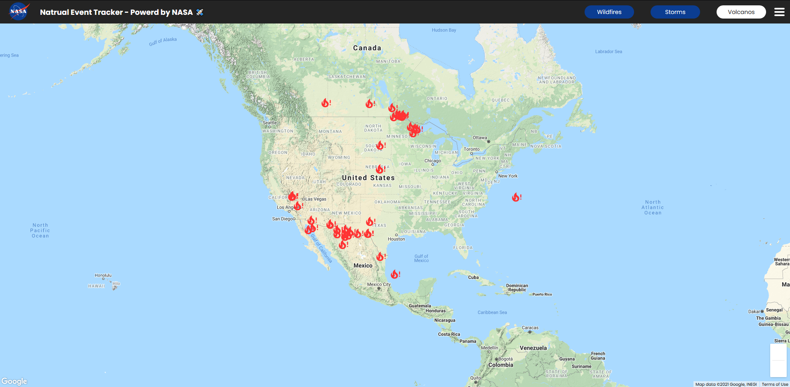
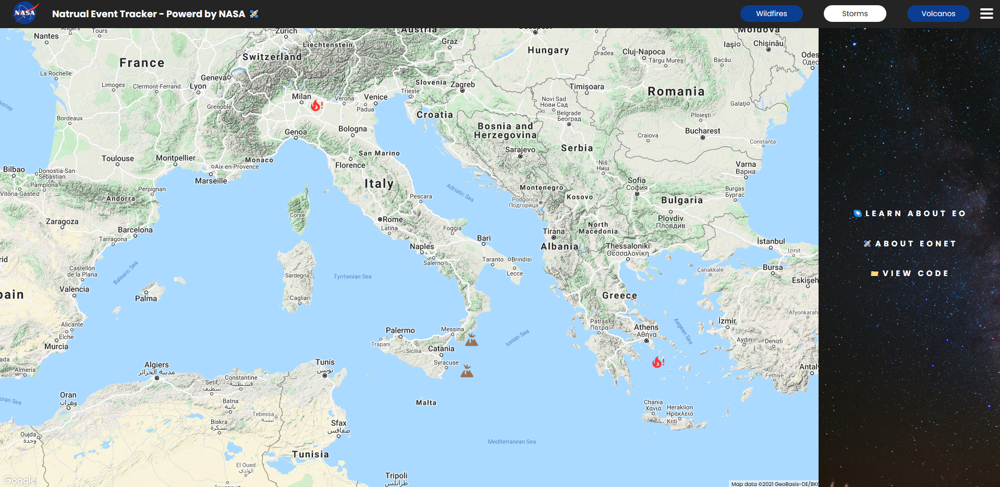
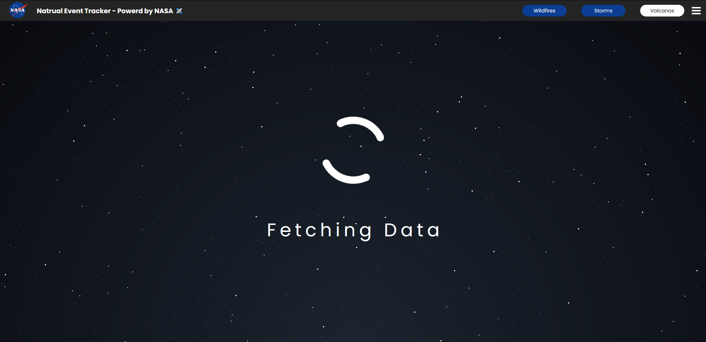

# Natural Event Tracker

> A browser-based Natural Event Tracker using React and the NASA EONET API to fetch data and plot events onto Google maps. Once events have been plotted onto the Google
> maps API, users can toggle which events they want to see (wildfires, storms, or active volcanos). Users are also able to click on event icons to see a box with additional information.

## Table of contents

- [General info](#general-info)
- [Screenshots](#screenshots)
- [Technologies](#technologies)
- [Features](#features)
- [Contact](#contact)

## General info

This project takes advantage of React to plot events fetched from NASA EONET API gathered from the Earth observatory onboard the International Space Station (ISS).

When the page is loaded the user is presented with a loading screen allowing the data to be fetched in the background.

Once the data is fetched the loader is replaced with the Google maps component.

## Screenshots

## Technologies

- React
- JavaScript
- EONET API
- Google Maps React
- Axios
- CSS3
- SCSS
- HTML5

## Features

List of features ready and TODOs for future development

- Data fetched using Axios.
- Working error catching.
- Buttons to toggle events
- Google maps React implementation
- Custom SCSS organized by components.

To-do list:

- Add the ability to see Icebergs.
- Add ability to see the path of Storms.

## Contact

Created by [@JordanBurch101](https://jordanburch.dev/) - feel free to contact me!
